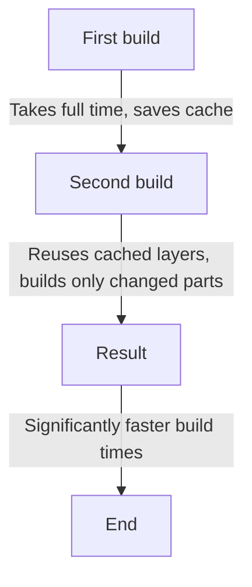
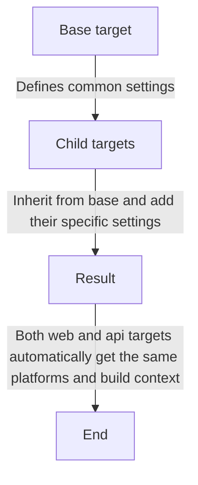

<a href="https://stackoverflow.com/users/1755598"></a>


[](https://www.linkedin.com/in/nirgeier/)
[](mailto:nirgeier@gmail.com)
[](mailto:nirg@codewizard.co.il)

---


---


<!-- omit in toc -->
# Docker Bake

<!-- omit in toc -->
## Table of Contents

- [1. Introduction](#1-introduction)
  - [What is Docker `Docker Bake`?](#what-is-docker-docker-bake)
  - [What is Docker `BuildKit`?](#what-is-docker-buildkit)
  - [Key Features](#key-features)
- [Comparison: Docker Bake vs Docker Compose](#comparison-docker-bake-vs-docker-compose)
- [Docker Bake syntax](#docker-bake-syntax)
- [Common Commands](#common-commands)
- [Advanced Features](#advanced-features)
  - [Multi-Stage Builds with Matrix](#multi-stage-builds-with-matrix)
  - [Build Secrets](#build-secrets)
  - [Cache Configuration / Build Caching](#cache-configuration--build-caching)
  - [Cache Configuration / Build Caching Workflow](#cache-configuration--build-caching-workflow)
  - [Target Inheritance](#target-inheritance)

---

## 1. Introduction

### What is Docker [`Docker Bake`](https://docs.docker.com/build/bake/)?
  
  - 👍 `Docker Bake` is a feature of [`BuildKit`](https://docs.docker.com/build/buildkit/) / [`Docker Buildx`](https://docs.docker.com/reference/cli/docker/buildx/) that allows you 
  to define and orchestrate complex builds using a high-level build tool that uses to build Docker images defined in configuration files.
  
  - 👍 `Docker Bake` is written in a declarative language (`HCL`, `JSON`, or `YAML`). 
  
  - 👍 `Docker Bake` is designed for building **multiple images or targets concurrently**, making it ideal for monorepos, microservices, or any project with several `Dockerfiles`.
  
  - 👍 `Docker Bake` extends beyond single `Dockerfile`s to support complex build scenarios with multiple targets, platforms, and configurations.
  
  - 👍 `Docker Bake` is designed for CI/CD pipelines, multi-platform builds, and complex build workflows.

---

### What is Docker [`BuildKit`](https://docs.docker.com/build/buildkit/)?

  - 👍 `BuildKit` is a modern build subsystem for Docker that improves performance, storage management, and caching  

  - 👍 `BuildKit` is the engine behind `Docker Bake`, enabling advanced features like multi-platform builds, caching, and build secrets

  - 👍 `BuildKit` is the default build engine for Docker, replacing the traditional docker build mechanism.

  - 👍 `BuildKit` allows for parallel builds, advanced caching, and better resource utilization.

  - 👍 `BuildKit` supports advanced features like build secrets, SSH forwarding, and more.

  - 👍 `BuildKit` is a key component of the new Docker Engine 20.10 release, which includes the `buildkit` subcommand and the `docker buildx` command.

---

### Key Features


| Feature                             | Description                                                                          |
|-------------------------------------|--------------------------------------------------------------------------------------|
| **Advanced BuildKit Features**      | Leverage BuildKit for caching, multi-platform builds, and advanced outputs.          |
| **Advanced caching**                | Sophisticated caching strategies for faster builds                                   |
| **Build matrix**                    | Define multiple build configurations and targets                                     |
| **Build secrets**                   | Securely pass sensitive information during builds                                    |
| **Cache configuration**             | Fine-tune caching strategies for faster builds                                       |
| **CI/CD integration**               | Ideal for automated build pipelines and workflows                                    |
| **Concurrent Builds**               | Build multiple images in parallel with a single command.                             |
| **Custom build arguments**          | Specify different build arguments for each target                                    |
| **Custom build contexts**           | Specify different directories for each target                                        |
| **Custom Dockerfiles**              | Use different Dockerfiles for each target                                            |
| **Declarative Build Configuration** | Define build targets, groups, arguments, tags, and more in a single file.            |
| **Declarative syntax**              | Use HCL, JSON, or YAML to define build configurations                                |
| **Extensibility**                   | Supports custom build steps and plugins                                              |
| **Flexible File Formats**           | Supports HCL (HashiCorp Configuration Language), JSON, and YAML (Compose extension). |
| **Group targets**                   | Organize multiple build targets into logical groups                                  |
| **Inheritance**                     | Reuse common configurations across multiple targets                                  |
| **Integration with Docker Compose** | You can use Compose files as Bake files for seamless migration.                      |
| **Matrix Builds**                   | Easily define build matrices for different platforms, versions, or configurations.   |
| **Multi-platform builds**           | Build for multiple architectures simultaneously (ARM, AMD64, etc.)                   |
| **Variable interpolation**          | Use variables and functions for dynamic configurations                               |

---

## Comparison: Docker Bake vs Docker Compose

| Feature             | Docker Bake                 | Docker Compose        |
|---------------------|-----------------------------|-----------------------|
| **Purpose**         | Build orchestration         | Service orchestration |
| **File Format**     | HCL, JSON, YAML (Compose)   | YAML                  |
| **Parallel Builds** | Yes                         | No                    |
| **Multi-platform**  | Yes (via BuildKit)          | Limited               |
| **Service Deploy**  | No                          | Yes                   |
| **Caching**         | Advanced BuildKit caching   | Basic                 |
| **Inheritance**     | Yes                         | No                    |
| **CI/CD**           | Ideal for CI/CD pipelines   | Limited               |
| **Extensibility**   | Supports custom build steps | Limited               |
| **Advanced**        | Advanced build features     | Basic                 |

---

> [!WARNING] 
> `Docker Bake` requires Docker Engine v20.10.0 or higher.  
> `Docker Bake` requires BuildKit for advanced build features.

---

##  Docker Bake syntax

> [!IMPORTANT] 
> `docker-bake.hcl` is a declarative build configuration file format.  


- Here's a basic `docker-bake.hcl` file structure:
- It uses the HashiCorp Configuration Language (HCL) syntax for defining build configurations.
- This example defines two targets: `frontend` and `backend-api`, each with its own context, Dockerfile, tags, platforms, and build arguments.

  ```hcl
  # Define variables
  variable "TAG" {
    default = "latest"
  }

  # Define a user variable for tagging images
  # This can be your Docker Hub username or any identifier
  variable "USER" {
    default = "username"
  }

  # Define a group of targets for default builds
  group "default" {
    targets = ["frontend", "backend-api"]
  }

  # Frontend service
  target "frontend" {
    # Directory containing the frontend code
    context  = "./frontend"           
    
    # Use a specific Dockerfile for production
    dockerfile = "Dockerfile.prod" 
    
    # Tag the image with user and tag         
    tags     = ["${USER}/frontend:${TAG}"]    
    
    # Build for multiple architectures
    platforms  = ["linux/amd64", "linux/arm64"]   
    
    # Pass build-time variables to the Dockerfile 
    args = {
      # Set Node.js environment to production
      NODE_ENV = "production" 

      # Set API URL for the frontend
      API_URL = "https://api.codewizard.com"
    }
  }

  # Node.js backend service
  target "backend-api" {
    context  = "./backend" 
    dockerfile = "Dockerfile"
    tags     = ["${USER}/backend:${TAG}"]
    platforms  = ["linux/amd64", "linux/arm64"]
     args = {
      NODE_ENV = "production"
    }
  }
  ```

- Here is another example of a `Docker Bake` configuration file: in JSON
  
  ```json
  {
    "variable": {
      "TAG": {
        "default": "latest"
      },
      "USER": {
        "default": "username"
      }
    },
    "group": {
      "default": {
        "targets": ["frontend", "backend-api"]
      }
    },
    "target": {
      "frontend": {
        "context": "./frontend",
        "dockerfile": "Dockerfile.prod",
        "tags": ["${USER}/frontend:${TAG}"],
        "platforms": ["linux/amd64", "linux/arm64"],
        "args": {
          "NODE_ENV": "production",
          "API_URL": "https://api.codewizard.com"
        }
      },
      "backend-api": {
        "context": "./backend",
        "dockerfile": "Dockerfile",
        "tags": ["${USER}/backend:${TAG}"],
        "platforms": ["linux/amd64", "linux/arm64"],
        "args": {
          "NODE_ENV": "production"
        }
      }
    }
  }
  ```

---

## Common Commands

| Feature                     | Description                                       | Command                                           |
|-----------------------------|---------------------------------------------------|---------------------------------------------------|
| Build Default Group         | Build all targets in the default group            | `docker buildx bake`                              |
| Build Specific Target       | Build a specific target by name                   | `docker buildx bake <target>`                     |
| Build with Custom Variables | Override variables for a specific build           | `docker buildx bake --set <target>.<var>=<value>` |
| Build and Push              | Build images and push them to a registry          | `docker buildx bake --push`                       |
| Build for Specific Platform | Build images for a specific platform architecture | `docker buildx bake --platform <platform>`        |
| View Build Configuration    | Print the effective build configuration           | `docker buildx bake --print`                      |
| Build with Custom File      | Use a custom bake file instead of the default     | `docker buildx bake -f <file>`                    |

---

## Advanced Features

### Multi-Stage Builds with Matrix

- **What is a Build Matrix?**
  - A build matrix allows you to create **multiple image variations from a single configuration**. 
  - This is useful when you need to build multiple versions of your application or service.
  - For example, you might need to build different versions of your application for different environments (e.g., development, staging, production).
  - By using a build matrix, you can specify multiple combinations of values for each configuration option.
  - Instead of writing separate targets for each combination, Docker Bake automatically generates all possible combinations.

- **Example:** Building multiple Node.js versions for different environments

  ```hcl
  target "app" {
    matrix = {
      version = ["18", "20"]
      env = ["dev", "prod"]
    }
    
    name = "app-node${version}-${env}"
    context = "."
    dockerfile = "Dockerfile"
    tags = ["myapp:node${version}-${env}"]
    
    args = {
      NODE_VERSION = "${version}"
      NODE_ENV     = "${env}"
    }
  }
  ```

- Quiz: What will be the output of the above example?
<details>
  <summary>Answer</summary>
  <ul>
    <li>app-node18-dev</li>
    <li>app-node18-prod</li>
    <li>app-node20-dev</li>
    <li>app-node20-prod</li>
  </ul>
  <hr/>
  - Each build will use the specified Node.js version and environment.
  - The `name` field dynamically constructs the image name based on the matrix values.
  - The `args` field passes the Node.js version and environment as build arguments to the Dockerfile.
  - The `tags` field tags the built images with the corresponding Node.js version and environment.
  - The `context` and `dockerfile` fields specify the build context and Dockerfile to use for all builds.
  - The `matrix` field defines the combinations of `version` and `env` to build.
</details>

---

### Build Secrets

- `Build secrets` allow you to securely pass sensitive information (like API keys, passwords, or certificates) to your Docker build process without including them in the final image or build history.
- This is particularly useful for keeping sensitive data out of your Docker images and ensuring that it is only available during the build process. 
- `Build secrets` can be stored in a secure location, such as a secure vault or a secret management service, and then referenced during the build process.
- `Build secrets` are mounted into the build environment at runtime, allowing you to use them without exposing them in the final image.
- `Build secrets` are not stored in the final image layers, ensuring that sensitive information is not leaked.
- `Build secrets` are only available during the build process and are not accessible to the final image or container.
- `Build secrets` are defined in the `docker-bake.hcl` file using the `secret` field.
- You can use the `--secret` flag to pass secrets to the build process.
- Secrets can also be defined in the Dockerfile using the `RUN --mount=type=secret` syntax.
  

- **Example:** Using a secret file during build

  ```hcl
  target "secure-app" {
    context = "."
    dockerfile = "Dockerfile"
    secret = [
      "id=mysecret,src=./secret.txt"
    ]
    tags = ["myapp:secure"]
  }
  ```

-  **`Dockerfile`**:
  
  ```dockerfile
  FROM node:18

  # Use the secret during build (it wont be in the final image)
  # as mentioned and explained above

  RUN --mount=type=secret,id=mysecret \
      API_KEY=$(cat /run/secrets/mysecret) && \
      npm install --registry=https://registry.example.com
  ```

---

### Cache Configuration / Build Caching

- `Docker Bake` supports advanced caching strategies to speed up builds and reduce resource usage.
- Caching allows you to reuse previously built layers, which can significantly speed up the build process
- `Docker Bake` can use different cache sources, such as local files, remote registries, or GitHub Actions cache.
- Caching can be configured using the `cache-from` and `cache-to` fields in the `docker-bake.hcl` file.
- Caching can also be configured using the `--cache-from` and `--cache-to` flags when running the `docker buildx bake` command.
- Caching can be used to speed up builds by reusing previously built layers, which can significantly reduce build times.
- Caching can also be used to reduce resource usage by avoiding unnecessary rebuilds of unchanged layers.
- Caching can be used to share build layers between different builds, which can further speed up the build process.
- Caching can be used to optimize the build process by reusing previously built layers, which can significantly reduce build times.
- Caching can reduce build times from minutes to seconds for unchanged code.
- **Example:** Using GitHub Actions cache

  ```hcl
  target "cached-app" {
    context = "."
    dockerfile = "Dockerfile"
    cache-from = ["type=gha"]
    cache-to = ["type=gha,mode=max"]
    tags = ["myapp:cached"]
  }
  ```

**Cache Types:**

| Type         | Description                        |
|--------------|------------------------------------|
| `type=gha`   | GitHub Actions cache (for CI/CD)   |
| `type=local` | Local filesystem cache             |
| `type=registry` | Docker registry cache           |


### Cache Configuration / Build Caching Workflow 




### Target Inheritance

- `Docker Bake` allows you to create a base configuration and reuse it across multiple targets. 
- This follows the DRY (Don't Repeat Yourself) principle - define common settings once and inherit them.

**Example:** Sharing common settings across multiple builds

| Setting                                      | Description                                              |
|----------------------------------------------|----------------------------------------------------------|
| `target "base"`                              | This is a base target that defines common build settings |
| `context = "."`                              | Uses the current directory as the build context          |
| `dockerfile = "Dockerfile"`                  | Uses the default Dockerfile                              |
| `platforms = ["linux/amd64", "linux/arm64"]` | Builds for both AMD64 and ARM64 architectures            |
| `tags = ["myapp:latest"]`                    | Sets the default tag for the image                       |
| `cache-from = ["type=gha"]`                  | Uses GitHub Actions cache for the build                  |
| `cache-to = ["type=gha,mode=max"]`           | Saves the cache to GitHub Actions cache with             |

```hcl
# Base target with common settings
target "base" {
  context = "."
  dockerfile = "Dockerfile"
  platforms = ["linux/amd64", "linux/arm64"]
  tags = ["myapp:latest"]
  cache-from = ["type=gha"]
  cache-to = ["type=gha,mode=max"]
}

# Example: Using inheritance to define common settings (1)
target "web" {
  inherits = ["base"]
  tags = ["myapp/web:latest"]
  target = "web"
}

# Example: Using inheritance to define common settings (2)
target "api" {
  inherits = ["base"]
  tags = ["myapp/api:latest"]
  target = "api"
}
```

**How it works:**



**Benefits:**

- **Consistency**: Sharing - ensures consistent build configurations
- **Reusability**: All targets use the same base configuration
- **Maintainability**: Supports multiple targets with the same settings platforms in one place, affects all children
- **Cleaner code**: No repetitive configuration
- **DRY principle**: Avoids duplication of common settings
- **Flexibility**: Each target can still have its own specific settings
- **Scalability**: Easily add new targets with shared settings


