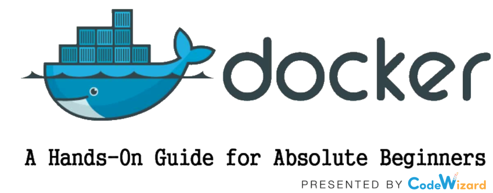

<a href="https://stackoverflow.com/users/1755598"></a>


[](https://www.linkedin.com/in/nirgeier/)
[](mailto:nirgeier@gmail.com)
[](mailto:nirg@codewizard.co.il)

---


---


<!-- omit in toc -->
# Basic Docker Hands-On Lab

- In this lab we will create a simple NodeJs server and run it inside a docker container. 
- Next, we will create a second container which will print some text to the screen. 
- We will also create a docker hub account and push our images to the cloud.

---

<!-- omit in toc -->
## Table of Contents

- [1. Verify Docker installation](#1-verify-docker-installation)
- [2. Building our NodeJs server](#2-building-our-nodejs-server)
- [3. Test our server code](#3-test-our-server-code)
  - [3.1. Test if the server is running](#31-test-if-the-server-is-running)
  - [3.2. Stop the server](#32-stop-the-server)
- [4. Creating Docker containers](#4-creating-docker-containers)
  - [4.1. Create `Dockerfile`](#41-create-dockerfile)
  - [5. Build the Docker image](#5-build-the-docker-image)
  - [5.1. Verifying that the container was created](#51-verifying-that-the-container-was-created)
  - [5.2. Testing the image](#52-testing-the-image)
  - [5.3 Test if the server is running and listening:](#53-test-if-the-server-is-running-and-listening)
- [6. Container with arguments](#6-container-with-arguments)

---

## 1. Verify Docker installation

- Run the following command in the shell to verify that Docker is installed and running

  ```sh
  docker run node
  ```

## 2. Building our NodeJs server
 
- In this section we will create a simple NodeJs server and later on we will run it inside a docker container.
- First, we will create a folder for our server code and then we will create the server code file.

  ```sh
  # Create the desired folder
  mkdir hello-docker
  # Switch to the created directory
  cd hello-docker
  ```

- Create our server code file (copy the code into this file)
[`server.js`](server.js)
  
  ```javascript
  // import the HTTP module
  var http = require('http');

  // Define a port we want to listen to
  const PORT=8080;

  // We need a function which handles requests and send response
  function handleRequest(request, response){
    response.end('It Works!! Path Hit: ' + request.url);
  }

  // Create a server
  var server = http.createServer(handleRequest);

  // Start our server
  server.listen(PORT, function(){
    //Callback triggered when server is successfully listening. Hurray!
    console.log("Server listening on: http://localhost:%s", PORT);
  });
  ```

## 3. Test our server code

- You can run the server code using NodeJs by executing the following command.
- This will run the server and listen to port 8080

  ```bash
  node server.js
  ```

### 3.1. Test if the server is running

- If you are using **Cloud Shell**, you can test it by clicking on the most left icon (web preview) and open port 8080 which is our server port
- If you are running it locally, you can test it by opening your browser 
- Use the following URL in your browser `http://localhost:8080`
- You should see the following message in your browser or terminal
  ```txt
  It Works!! Path Hit: /
  ```

### 3.2. Stop the server

- Type <kbd>CTRL</kbd>+<kbd>C</kbd> **twice** to stop the server

---

## 4. Creating Docker containers

### 4.1. Create `Dockerfile`

- In the same folder create the create a file called `Dockerfile` and add the following content:
  ```Dockerfile
  # Base image for Node.js
  FROM node:latest

  # Set the working directory in the container
  WORKDIR /usr/src/app

  # Copy the server file into the container 
  # (Don`t forget the dot at the end)
  COPY server.js .

  # Expose port 8080
  # This is the port our server will listen to
  EXPOSE 8080
  
  # Start the Node.js server
  CMD [ "node", "server.js" ]
  ```
- This Dockerfile does the following:
- Uses the latest Node.js image as the base image
- Sets the working directory inside the container to `/usr/src/app`
- Copies the `server.js` file from the current directory into the container's working directory
- Exposes port 8080 so that it can be accessed from outside the container
- Specifies the command to run when the container starts, which is `node server.js`

> [!NOTE] 
Make sure that the `Dockerfile` is in the same directory as the `server.js` file.

> [!IMPORTANT] 
The `COPY` command in the Dockerfile is used to copy files from the host machine into the container. The first argument is the source file (in this case, `server.js`), and the second argument is the destination path inside the container (`.` means the current working directory in the container).

---

### 5. Build the Docker image

- In this step we will build the Docker image using the `Dockerfile` we created in the previous step.
> [!IMPORTANT] 
Make sure you are in the same directory where the `Dockerfile` and `server.js` files are located.

- Build the image using docker build with the following parameters
  ```
  --t = Tag name which will be attached to the container
  .   = The Context to the Dockerfile (current folder in our case)
  
  # Sample command to build the image
  docker build -t hello-node:v1 .
  ```

### 5.1. Verifying that the container was created

- Let's verify that the image was created successfully by listing all the images on our system
- Run the following command to list all Docker images:
  ```bash
  docker images
  ```
- You should see an output similar to this:
  ```txt
  REPOSITORY          TAG       IMAGE ID       CREATED          SIZE
  hello-node          v1        123456789abc   10 seconds ago   200MB
  node                latest    abcdef123456   2 days ago       150MB
  ```

### 5.2. Testing the image 

- Now we can run the container using the image we just created
- Execute `docker run` command with the following flags:

  | Option | Description |
  |------|-------------|
  | `-d` | Run container in background (daemon mode) |
  | `-p` | Map internal port 8080 to external port 8080 |
  | `hello-node:v1` | The name of the image we just created |

  ```bash
  # Run the container in the background
  docker run -d -p 8080:8080 hello-node:v1
  ```

### 5.3 Test if the server is running and listening:

- If you are using **Cloud Shell**, you can test it by clicking on the most left icon (web preview) and open port `8080` which is our server port
- If you are running it locally, you can test it by opening your browser 
- Use the following URL in your browser `http://localhost:8080`
- You should see the following message in your browser or terminal
  ```txt
  It Works!! Path Hit: /
  ```
---
  
## 6. Container with arguments

- Let's test another container which will print content to screen


> [!WARNING]  
> You might get the following error:
>
> docker: [DEPRECATION NOTICE] Docker Image Format v1 and Docker Image manifest version 2, schema 1 support is disabled by default and will be removed in an upcoming release.
 
- Run the following command to run a container with arguments
  ```bash
  docker run docker/whalesay cowsay boo
  ```
- You should see the following output in your terminal
  ```txt
  ________
  < boo >
  --------
          \  ^__^
          \  (oo)\_______
              (__)\       )\/\
                  ||----w |
                  ||     ||
  ```

