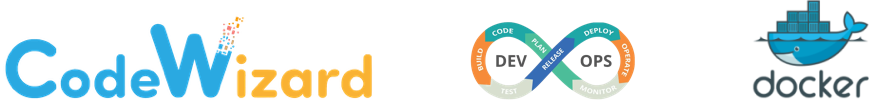

<a href="https://stackoverflow.com/users/1755598"></a>


[](https://www.linkedin.com/in/nirgeier/)
[](mailto:nirgeier@gmail.com)
[](mailto:nirg@codewizard.co.il)

---



---

# Docker Hands-on Repository

- A collection of Hands-on Docker labs.
- Each lab is a standalone lab and does not require to complete the previous labs.

## Pre-Requirements

- Docker installation

---


[](https://console.cloud.google.com/cloudshell/editor?cloudshell_git_repo=https://github.com/nirgeier/DockerLabs)

### **<kbd>CTRL</kbd> + click to open in new window**

---


- Link to the online version of this repository:
  https://nirgeier.github.io/DockerLabs

---

## Labs

| Lab                                                                 | Description                                                                              |
|:--------------------------------------------------------------------|:-----------------------------------------------------------------------------------------|
| [001 - Docker CLI](Labs/001-DockerCli/)                             | Practice the core Docker CLI commands for running, inspecting, and managing containers.  |
| [002 - Dockerfile Basics](Labs/002-DockerFile/)                     | Build your first Node.js container image from a Dockerfile and publish it to a registry. |
| [003 - Dockerfile Multi-Stage](Labs/003-DockerFile-MultiStage/)     | Learn how multi-stage Dockerfiles produce lean images across build targets.              |
| [004 - Local Registry](Labs/004-LocalRegistry/)                     | Stand up a private registry, retag images, and push or pull them locally.                |
| [005 - Docker Compose Stack](Labs/005-DockerCompose-Basics/)        | Orchestrate a WordPress and MariaDB stack with Docker Compose.                           |
| [006 - Compose Environments](Labs/006-DockerCompose-env/)           | Structure Compose files and env vars for dev and prod workflows.                         |
| [007 - Docker Compose Fragments](Labs/007-DockerCompose-fragments/) | Learn advanced Docker Compose features with fragments and modular configurations.        |
| [008 - CRI `crictl`](Labs/008-crictl/)                              | Learn about container runtime interface tooling using crictl.                            |
| [009 - Dive Layers](Labs/009-dive-layers/)                          | Explore image layer creation and visualize them with the dive tool.                      |
| [010 - Docker Bake](Labs/010-bake/)                                 | Use Docker Buildx Bake to coordinate complex, multi-target image builds.                 |
| [011 - Security & Trust](Labs/011-Security&Trust/)                  | Learn advanced Docker security features and best practices for container security.       |
| [012 - gVisor Seccomp](Labs/012-gvisor/)                            | Apply a gVisor runtime profile to block privileged syscalls inside a container.          |
| [013 - Resource Isolation](Labs/013-Cgroup/)                        | Learn about resource isolation using Linux Cgroups in Docker containers.                 |
| [014 - Docker Daemon](Labs/014-DockerDaemon/)                       | Configure and manage the Docker daemon, including logging, storage, and security.        |
| [015 - Docker Networking](Labs/015-Networking/)                     | Understand Docker networking fundamentals, drivers, and custom networks.                 |
| [016 - Advanced Build](Labs/016-Advanced-Build/)                    | Advanced Docker build techniques using BuildKit and BuildX for multi-platform images.    |
| [017 - Logging with Fluentd](Labs/017-Logging/)                     | Use Fluentd with Docker to collect and manage logs from containers and events.           |
| [100 - Hands-On Intro](Labs/100-Hands-On/)                          | Guided Node.js exercise covering the full build, run, and publish workflow.              |

## How to Use These Labs

There are several ways to run the Docker Labs. Choose the method that works best for you.

### 1. Killercoda (Recommended)

The easiest way to get started with the labs. Learn Docker in your browser without any local installation.

- **[Launch on Killercoda](https://killercoda.com/codewizard/scenario/DockerLabs)**

**Benefits:**
- No installation required
- Pre-configured environment
- Works on any device with a web browser
- All tools pre-installed

### 2. From Source

For those who prefer to run it directly on their machine:

```bash
# Clone the repository
git clone https://github.com/nirgeier/DockerLabs.git
# Change to the Labs directory
cd DockerLabs/Labs
# Start with the Docker CLI lab
cd 001-DockerCli
# Follow the instructions in the README of each lab
cat README.md
```

**Prerequisites:**
- Docker installed on your system
- A Unix-like operating system (Linux, macOS, or Windows with WSL)
- Basic command-line tools

### 3. Using Google Cloud Shell

Google Cloud Shell provides a free, browser-based environment with all necessary tools pre-installed.

- Click the button below to open in Google Cloud Shell:

[](https://console.cloud.google.com/cloudshell/editor?cloudshell_git_repo=https://github.com/nirgeier/DockerLabs)

- The repository will automatically be cloned into a free Cloud instance.
- Use **<kbd>CTRL</kbd>** + click to open it in a new window.
- Follow the instructions in the README of each lab.

**Benefits:**
- No local installation required
- Pre-configured environment
- Works on any device with a web browser
- All tools pre-installed
- Free tier available

---

### Preface

- Prior to Docker we had to use 3<sup>rd</sup> party tools for virtualization
- Docker relay on Linux Kernel 3.8.13 and above. 
- This version added the required features for executing Docker at kernel level
- Docker is based upon [Linux Container](#what-is-a-container)

---

## Containers Overview

- Containers `share the same host kernel`.

### `cgroups`

- Containers `use kernel cgroups`.
- **A `cgroup` is a collection of processes that are bound to a set of limits or parameters defined via the cgroup filesystem.**
- Control groups, usually referred to as `cgroups`, are a Linux kernel feature which **allow processes to be organized into hierarchical groups whose usage of various types of resources can then be limited and monitored**. cgroups consist of one hierarchy (tree) per resource (cpu, memory, …)
- The kernel's cgroup interface is provided through a pseudo-filesystem called `cgroupfs`.
- Grouping is implemented in the core cgroup kernel code, while resource tracking and limits are implemented in a set of per-resource-type subsystems (memory, CPU, and so on).

### `namespace`

- Containers `use kernel namespaces` for isolation.
- A namespace wraps a global system resource in an abstraction that makes it appear to the processes within the `namespace` that they have **their own isolated instance of the global resource.**
- Changes to the global resource are **visible** to other processes that are **members of the namespace**, but are invisible to other processes.
- `namespace` Allow you to create isolation of:
  - Process trees (PID Namespace)
  - Mounts (MNT namespace) `wc -l /proc/mounts`
  - Network (Net namespace) `ip addr`
    - Isolation on the networking level is achieved through the creation of virtual switches in the linux kernel.
  - Users / UIDs (User Namespace)
    - **User namespaces** isolate security-related identifiers and attributes, in particular, user IDs and group IDs
  - Hostnames (UTS Namespace) `hostname`
  - Inter Process Communication (IPC Namespace) `ipcs`

### `LXC` / `Libcontainer`

- In the past Docker were based upon `Linux containers` (`LXC`).
- `LXC` is a composition of `cgroup` & `namespace` for providing isolated environment which allow sandboxing processes from one another, and controlling their resource allocations.
- `LXC` bundles with the kernel’s `Cgroups` to provide the functionality for the process and network space instead of creating a full virtual machine and provides an isolated environment for the applications.
- With the release of version 0.9 Docker.io have dropped LXC as the default execution environment, replacing it with their own `runc/libcontainer`.
  - `Libcontainer` provides a native Go implementation for creating containers with namespaces, `cgroups`, capabilities, and filesystem access controls. It allows you to manage the lifecycle of the container performing additional operations after the container is created
- In July 2015 Docker moved to `runc`
